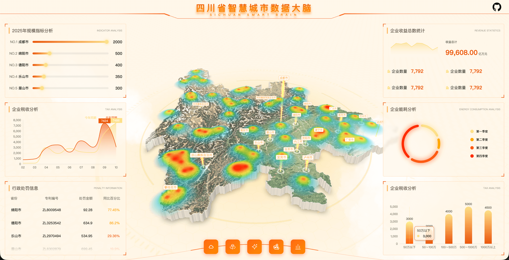
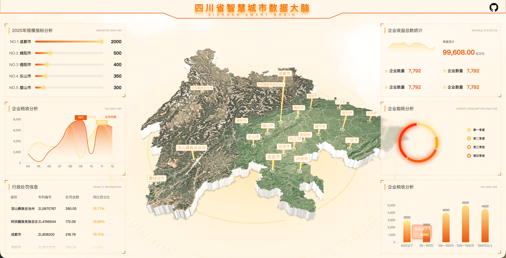

# 数据可视化大屏 (SC DataV)

[https://knight-l.github.io/sc-datav/](https://knight-l.github.io/sc-datav/)

[https://knight-l.github.io/sc-datav/demo1](https://knight-l.github.io/sc-datav/demo1)


## 功能特性

1. **3D 地图可视化**: 基于 Three.js 的 3D 地图渲染，轮廓飞线动画效果，侧边扫光视觉效果
2. **省级地图展示**: 四川省地理轮廓精确呈现
3. **多图表联动**: 柱状图、折线图等多种数据可视化形式
4. **响应式设计**: 支持多种屏幕尺寸自适应
5. **实时调试面板**: 使用 Leva 实现参数实时调整

## 技术栈

本项目是一个基于现代 Web 技术的数据可视化大屏应用，主要技术栈包括：

- **核心框架**: React 19 + TypeScript
- **构建工具**: Vite (Rolldown 版本)
- **3D 可视化**: Three.js + @react-three/fiber + @react-three/drei
- **数据可视化**: ECharts
- **地理数据处理**: D3-geo
- **动画库**: GSAP
- **样式库**: Styled-components
- **调试工具**: Leva
- **自适应布局**: autofit.js

## 目录结构

```
src/
├── assets/             # 静态资源文件
│   ├── sc.json         # 四川省地理数据
│   └── sc_outline.json # 四川省轮廓数据
├── components/         # 通用组件
│   ├── chart.tsx       # 图表组件
│   └── seamVirtualScroll.tsx # 虚拟滚动组件
├── hooks/              # 自定义Hooks
├── pages/SCDataV/      # 数据大屏页面
│   ├── index.tsx       # 页面入口
│   ├── scMap.tsx       # 地图组件
│   ├── flyLine.tsx     # 飞线动画组件
│   ├── chart1.tsx      # 图表1
│   ├── chart2.tsx      # 图表2
│   ├── chart3.tsx      # 图表3
│   └── content.tsx     # 内容布局组件
└── App.tsx             # 应用根组件
```

## 开发指南

### 环境要求

- Node.js >= 18
- PNPM >= 8

### 安装依赖

```bash
pnpm install
```

### 开发运行

```bash
# 启动开发服务器
pnpm dev
```

### 构建部署

```bash
# 构建生产版本
pnpm build

# 预览构建结果
pnpm preview
```
